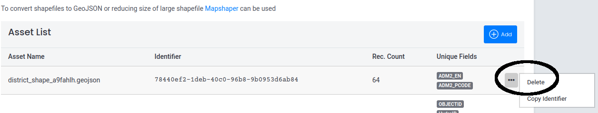

In profile view page, click on "Assets" tab to view a list of your assets. (<a href="{{ interwiki.mapshaper }}"> DataEx > User Profile > Assets</a> )

User assets will be displayed row by row in a table as shown in the image below. At the right end of each row there is a button with an ellipsis. Click on it to get a delete option.

{ align=right, width=800 }

It will delete the corresponding asset displayed in that row. 
