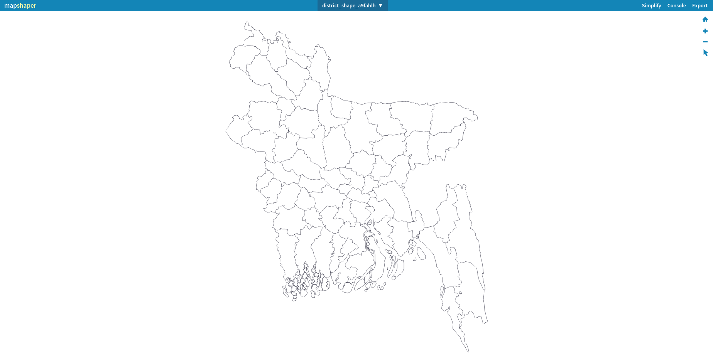

 

Before uploading the shapefiles like GeoJson you must ensure the following:

- Shapefile is in Geographic Co-ordinate system
- Shapefile doesn't contain any invalid geometry

### Converting Shapefile to GeoJson

To convert ESRI shapefile `.shp` to GeoJson format, you can make use of <a href="{{ interwiki.mapshaper }}">Mapshaper</a> shown below.

{ align=right, width=800 }

You can either drop the file directly or just click on the select button to upload from your local folder. After selecting the file you want to use, click on import to load the map data.

{ align=right, width=800 }

After importing the shapefile, you can view the content stored in the shape file.
 { align=left, width=800 }
 
Click on the simplify tab to open the simplification menu. Select a method from the options displayed and click apply. 
 
{ align=right, width=800 }
 
Then, using a horizontal scroll bar you can choose how much you would like to simplify the lines. 
 
{ align=right, width=800 }
 
After settling on the desired simplification level, just click on export tab to get a menu from which you can choose GeoJson and export to a GeoJson file.

{ align=right, width=800 }

After exporting, you will have simplified your shapefile and converted it to a GeoJson format and reduced its size as well.
