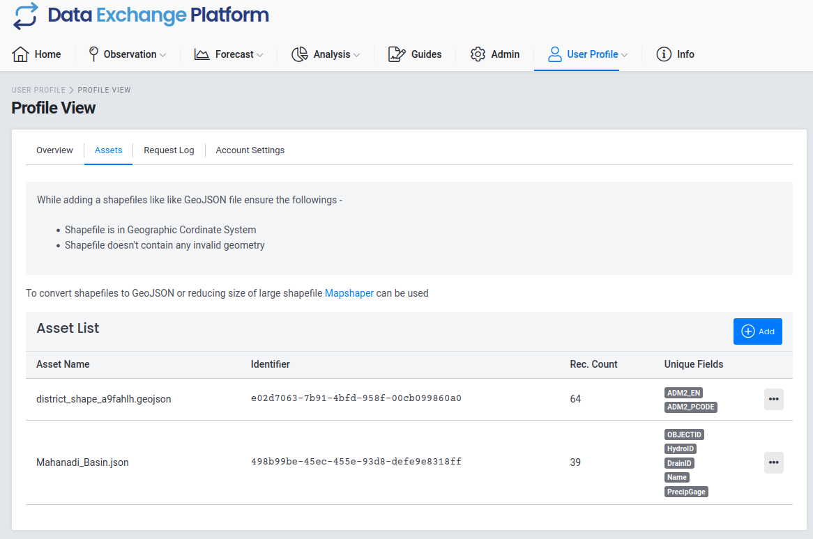

DataEx users can upload their own shape files and use the forecast analysis engine to perform analysis using the shapefile. Below, we explain how you can upload your shapefile. 

### User assets
Go to <a href="{{interwiki.home}}">DataEx home page</a> then click on user profile tab to get a drop down menu and select profile view. This will take you to your user profile page where you can see your user details, permissions, account settings and also assets.

{ align=centre, width=800 }

Click on the "Assets" tab to visit your assets list page. (<a href="{{ interwiki.mapshaper }}"> DataEx > User Profile > Assets</a> ) 

{ align=centre, width=800 }

You will see an asset list table with columns for the asset's name, identifier, record count, and unique fields . Each row consists of a different asset belonging to the user. 

### Upload asset
To upload an asset into DataEx, go back to profile view page and click on assets tab. There you can click on the add button. 

{ align=right, width=800 }

After clicking on the button, you will see a popup box for uploading files.

{ align=right, width=600 }

Browse for the shapefile you want to upload and click on the upload button inside the popup box,

{ align=left, width=600 }

 You will now see a new row added to the asset view showing the file you just uploaded. 

{ align=left, width=600 }

